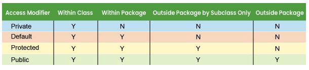

# Access Modifiers in Java

In Java, **access modifiers** control where classes, variables, methods, and constructors can be accessed from.

They help with:

- encapsulation
- security
- organization of code

---



> from [Java Access Modifiers](https://www.tutorialspoint.com/java/java_access_modifiers.htm)

---

# The 4 Access Modifiers

| Modifier                | Same Class | Same Package | Subclass | Everywhere |
| ----------------------- | ---------- | ------------ | -------- | ---------- |
| `public`                | ✅         | ✅           | ✅       | ✅         |
| `protected`             | ✅         | ✅           | ✅       | ❌         |
| default _(no modifier)_ | ✅         | ✅           | ❌       | ❌         |
| `private`               | ✅         | ❌           | ❌       | ❌         |

---

# 1. `public`

Accessible from anywhere.

---

## Example

```java id="mjlwm9"
public class Car {

    public String brand;

    public void drive() {
        System.out.println("Driving");
    }
}
```

Usage from another class:

```java id="jlwm5p"
Car c = new Car();

c.brand = "Toyota";
c.drive();
```

---

# 2. `private`

Accessible only inside the same class.

Used for data hiding (encapsulation).

---

## Example

```java id="9jlwmr"
class Person {

    private String name;

    public void setName(String n) {
        name = n;
    }

    public String getName() {
        return name;
    }
}
```

---

## Why Use `private`?

This prevents direct modification:

❌ Not allowed:

```java id="4jlwmx"
p.name = "Loko";
```

✅ Correct:

```java id="kjlwm8"
p.setName("Loko");
```

---

# 3. `protected`

Accessible:

- inside the same package
- by subclasses

---

## Example

```java id="xjlwm2"
class Animal {

    protected void eat() {
        System.out.println("Eating");
    }
}
```

Subclass:

```java id="8jlwmf"
class Dog extends Animal {

    void test() {
        eat();
    }
}
```

---

# 4. Default Access (Package-Private)

If no modifier is written:

```java id="jlwm0n"
class Test {

    int number;
}
```

It is accessible only inside the same package.

---

# Access Modifiers with Classes

Top-level classes can only be:

| Modifier    | Allowed? |
| ----------- | -------- |
| `public`    | ✅       |
| default     | ✅       |
| `private`   | ❌       |
| `protected` | ❌       |

---

# Real Example

```java id="gjlwm6"
class BankAccount {

    private double balance;

    public void deposit(double amount) {

        if (amount > 0) {
            balance += amount;
        }
    }

    public double getBalance() {
        return balance;
    }
}
```

Usage:

```java id="njlwm3"
BankAccount acc = new BankAccount();

acc.deposit(500);

System.out.println(acc.getBalance());
```

---

# Why Access Modifiers Matter

They help:

- protect sensitive data
- prevent accidental changes
- organize large applications
- enforce good OOP design

---

# Common Rule in OOP

Usually:

- variables → `private`
- methods → `public`

Example:

```java id="2jlwmv"
private String name;

public String getName() {
    return name;
}
```

---

# Visual Memory Trick

```text id="xjlwm9"
public     → everyone
protected  → family + package
default    → package only
private    → only me
```

---

# Quick Comparison Example

```java id="mjlwm1"
public class Example {

    public int a = 1;
    protected int b = 2;
    int c = 3; // default
    private int d = 4;
}
```

Inside the same class:
✅ can access all

Inside same package:
✅ `a`, `b`, `c`
❌ `d`

Subclass in another package:
✅ `a`, `b`
❌ `c`, `d`

Outside everywhere:
✅ `a`
❌ others

---

# Easy Way to Remember

| Modifier    | Think              |
| ----------- | ------------------ |
| `public`    | open to everyone   |
| `protected` | inheritance access |
| default     | package only       |
| `private`   | hidden completely  |
