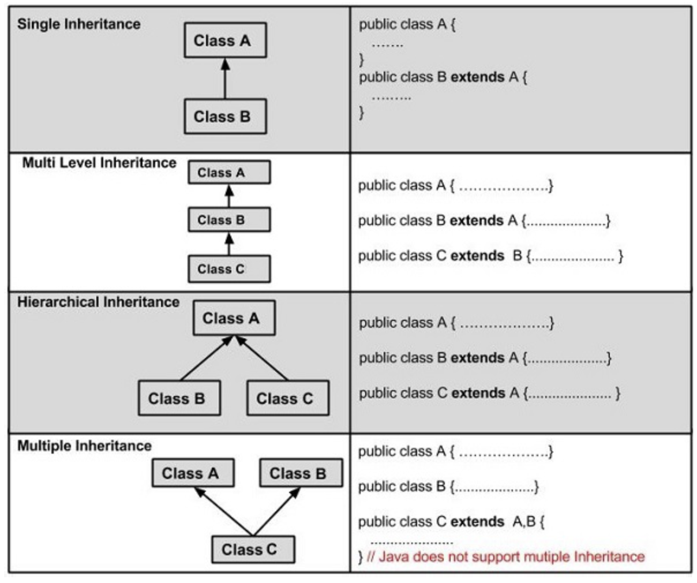

# Inheritance in Java

In Java, **Inheritance** is an OOP concept that allows one class to inherit fields and methods from another class.

It promotes **code reuse** and helps model real-world relationships.

## Types of Inheritance:



---

# Basic Idea

```text
Animal
   ↑
  Dog
```

A `Dog` is an `Animal`, so `Dog` can inherit the characteristics of `Animal`.

---

# Syntax

Use the `extends` keyword:

```java
class ChildClass extends ParentClass {
    // additional fields and methods
}
```

---

# Example

```java
class Animal {

    void eat() {
        System.out.println("Eating...");
    }
}

class Dog extends Animal {

    void bark() {
        System.out.println("Barking...");
    }
}
```

Usage:

```java
public class Main {
    public static void main(String[] args) {

        Dog dog = new Dog();

        dog.eat();
        dog.bark();
    }
}
```

Output:

```text
Eating...
Barking...
```

The `Dog` class inherited the `eat()` method from `Animal`.

---

# What Can Be Inherited?

A subclass inherits:

✅ Public methods
✅ Protected methods
✅ Public fields
✅ Protected fields

A subclass does **not** inherit:

❌ Private fields
❌ Private methods
❌ Constructors

---

# Constructor Inheritance

Constructors are not inherited, but the parent constructor can be called using `super()`.

```java
class Animal {

    Animal() {
        System.out.println("Animal created");
    }
}

class Dog extends Animal {

    Dog() {
        super();
        System.out.println("Dog created");
    }
}
```

Output:

```text
Animal created
Dog created
```

---

# The `super` Keyword

`super` refers to the parent class.

---

## Calling Parent Constructor

```java
super();
```

---

## Calling Parent Method

```java
super.eat();
```

Example:

```java
class Animal {

    void eat() {
        System.out.println("Animal is eating");
    }
}

class Dog extends Animal {

    void eat() {
        super.eat();
        System.out.println("Dog is eating");
    }
}
```

---

# Method Overriding

A child class can provide its own implementation of an inherited method.

```java
class Animal {

    void sound() {
        System.out.println("Animal sound");
    }
}

class Dog extends Animal {

    @Override
    void sound() {
        System.out.println("Bark");
    }
}
```

Usage:

```java
Dog dog = new Dog();
dog.sound();
```

Output:

```text
Bark
```

---

# Types of Inheritance in Java

## Single Inheritance

```text
Animal
   ↑
  Dog
```

```java
class Dog extends Animal {}
```

---

## Multilevel Inheritance

```text
Animal
   ↑
 Mammal
   ↑
  Dog
```

```java
class Animal {}
class Mammal extends Animal {}
class Dog extends Mammal {}
```

---

## Hierarchical Inheritance

```text
       Animal
      /      \
    Dog      Cat
```

```java
class Dog extends Animal {}
class Cat extends Animal {}
```

---

# Java Does NOT Support Multiple Class Inheritance

❌ Not allowed:

```java
class Dog extends Animal, Pet {}
```

This prevents ambiguity problems.

Instead, Java uses interfaces.

---

# Example with Access Modifiers

```java
class Animal {

    protected String name = "Animal";
}

class Dog extends Animal {

    void display() {
        System.out.println(name);
    }
}
```

`protected` members are accessible in subclasses.

---

# Real-World Example

```java
class Vehicle {

    String brand;

    void start() {
        System.out.println("Vehicle started");
    }
}

class Car extends Vehicle {

    int doors;

    void drive() {
        System.out.println("Driving...");
    }
}
```

Usage:

```java
Car car = new Car();

car.brand = "Toyota";

car.start();
car.drive();
```

---

# Why Use Inheritance?

### Without Inheritance

```java
class Dog {
    void eat() {}
}

class Cat {
    void eat() {}
}
```

Duplicate code.

---

### With Inheritance

```java
class Animal {
    void eat() {}
}

class Dog extends Animal {}
class Cat extends Animal {}
```

Code reuse.

---

# Important Relationship

Inheritance models an **"is-a"** relationship.

Examples:

✅ Dog is an Animal
✅ Car is a Vehicle
✅ Student is a Person

Bad example:

❌ Engine is a Car

That's a **has-a** relationship (composition), not inheritance.

---

# Easy Way to Remember

| Concept     | Meaning                    |
| ----------- | -------------------------- |
| `extends`   | inherit from a class       |
| `super`     | refer to parent class      |
| Override    | replace inherited behavior |
| Inheritance | code reuse + hierarchy     |
| Is-a        | inheritance relationship   |

### Quick Mental Model

```text
Parent Class
     ↑
     |
Child Class
```

The child gets everything accessible from the parent and can add or override behavior.
