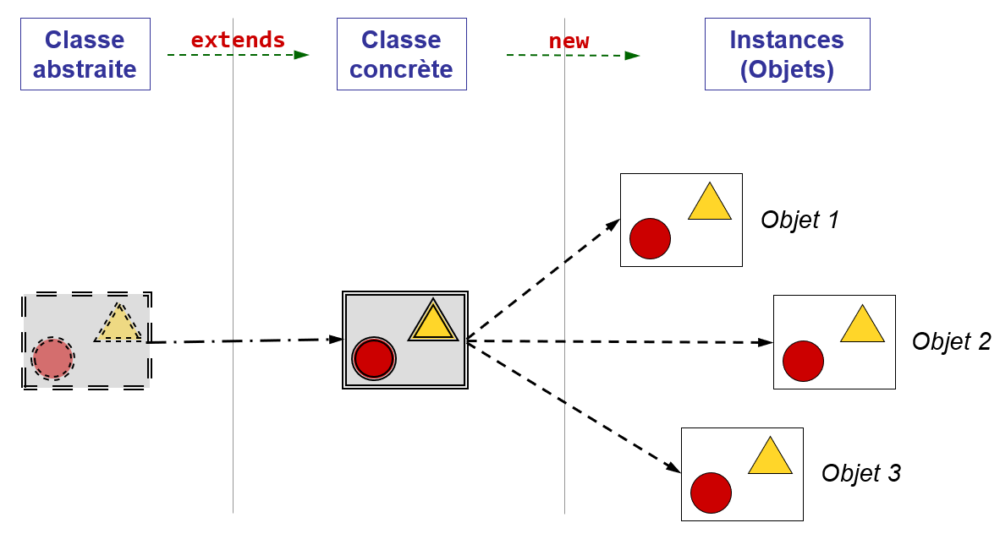

# Classe abstraite

## Définition

Une **classe abstraite** est une classe qui contient une ou plusieurs 
**méthodes abstraites**. Elle peut contenir d'autres méthodes _habituelles_ 
(appelée aussi méthodes concrètes). 

Si les classes peuvent être considérées comme étant des moules permettant de 
fabriquer des objets, nous pouvons dire que les classes abstraites 
sont des moules incomplets (plans non terminés) qui ne peuvent pas être 
utilisés tels quels pour créer des objets, mais qui peuvent être utilisés 
pour fabriquer d'autres plans plus précis (sous-classes) qui sont complétés 
et qui permettent eux de créer des objets (instance de sous-classes). Cette 
analogie est illustrée par la figure suivante :

## Règles concernant le modificateur _abstract_

Les règles suivantes s'appliquent aux classes abstraites : 
- Elles ne peuvent pas être instanciées. C'est-à-dire qu'on ne peut pas créer 
  d'objet de cette classe avec l'opérateur `new`.
- Elles ne peuvent pas être déclarées `final` lorsqu'elles possèdent des 
  méthodes abstraites puisque le modificateur `final` empêche la création d'une 
  sous-classe permettant de les redéfinir.
- Elles peuvent être déclarées `abstract` même sans posséder de méthodes 
  abstraites. Cela signifie qu'une telle classe est destinée à jouer le 
  rôle de type et de classe parente sans être instanciable.

Les règles suivantes s'appliquent aux sous-classes d'une classe abstraite :
- Elles ne peuvent être instanciées que si elles **implémentent** chaque 
  méthode abstraite de la classe parente.
- Si elles n'implémentent pas toutes les méthodes abstraites dont elles 
  héritent, les sous-classes sont, elles aussi, abstraites.

La règle suivante s'applique aux méthodes : Lorsqu'elles sont déclarées avec 
les modificateurs `static`, `private` ou `final`, elles ne peuvent pas être 
abstraites puisqu'elles ne peuvent pas être redéfinies dans une sous-classe.

## Utilité des classes abstraites

En pratique, les classes abstraites permettent de définir des 
fonctionnalités (comportements) que les sous-classes doivent impérativement 
implémenter même si la classe abstraite n'est pas en mesure de fournir une 
implémentation pour ces méthodes. Cela signifie que les utilisateurs des 
sous-classes d'une classe abstraite sont assurés de trouver dans les 
sous-classes concrètes toutes les méthodes définies dans la classe abstraite.

En résumé, les classes abstraites constituent une sorte de **contrat** qui 
garantit que certaines méthodes sont disponibles dans les sous-classes.

## Exemple

L'exemple illustre des formes géométrique avec une classe abstraite `Shape` et 
deux classes concrètes `Circle` et `Rectangle`. Comme le calcul de l'aire et 
du périmètre dépende de la forme, elles sont déclarées comme méthodes 
abstraites dans `Shape` et redéfinies dans les sous-classes `Circle` et 
`Rectangle`. Cela permet ainsi de définir des comportements sur toute forme 
de `Shape` en étant sûr que les classes concrètes réalisent les méthodes 
abstraites, selon le "contrat".

Pour démontrer cette possibilité, dans la classe `Main`, un tableau de `Shape` 
est créé et différentes formes y sont stockées grâce à la conversion 
élargissante. Même si `Shape` est une classe abstraite, il est possible de 
créer des variables de ce type. Par contre, il n'est pas possible 
d'instancier un objet `Shape` (avec `new`). Il est ensuite possible d'itérer 
le tableau et d'appeler la méthode `area()` qui s'applique à l'objet concret 
grâce au polymorphisme. 

# Exercice
Après avoir étudié attentivement les informations ci-dessus et compris le
code des classes `Circle`, `Rectangle` et `Shape`, identifiez les affirmations
correctes ci-dessous.