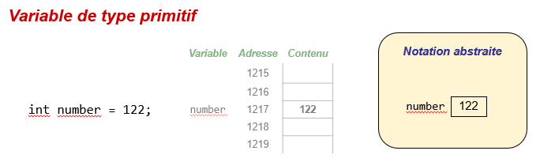
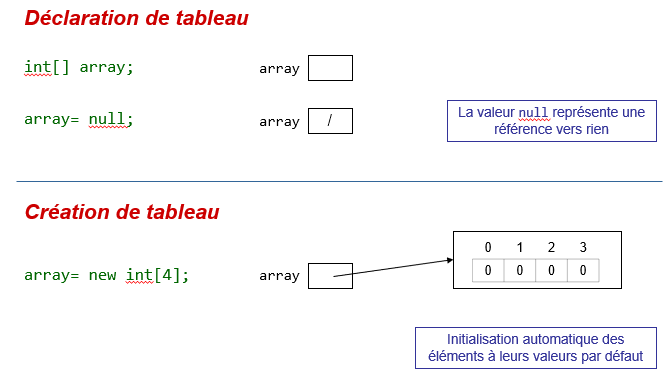
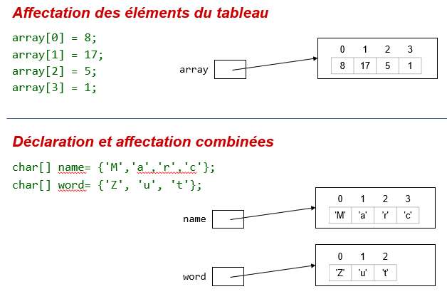
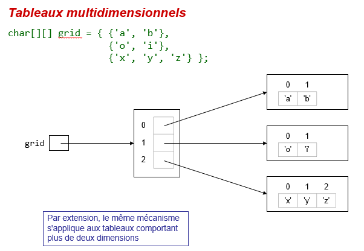
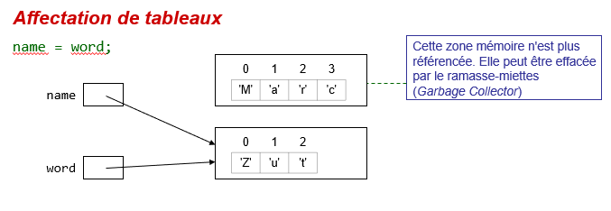

# Types primitifs versus objets

Comme les tableaux sont des objets, il est nécessaire de préciser quelques
points sur les objets et sur leur représentation en mémoire. La
compréhension de la représentation en mémoire permet de mieux comprendre ce
qui se passe lorsque qu'une référence sur un objet est passé en paramètre
d'une méthode.

Le chapitre sur les classes donnera encore plus de détails sur ces points.

## Représentation en mémoire de variables

Pour chaque variable d'un programme, une case mémoire est allouée. Le
contenu de la case mémoire n'est cependant pas le même pour un type
primitif ou pour un objet/tableau :

- Pour **les types primitifs**, la case mémoire contient la valeur de la
  variable. Par exemple, pour une variable `int` avec la valeur `1`, une
  case mémoire (taille : 4 octets) est allouée et la valeur 1 est sauvegardée
  dans la case mémoire.

Représentation de la mémoire pour les types primitifs :

- Pour **les objets et tableaux** (types référence), la case mémoire contient
  une référence à la zone mémoire contenant l'objet. Ainsi, à la déclaration du
  tableau, la case mémoire ne contient pas encore de référence. Après
  l'initialisation, la case mémoire contient une référence vers le tableau
  qui est stockée ailleurs en mémoire.

- Les objets peuvent être assignés à `null`, c'est-à-dire qu'ils ont une
  référence qui ne pointe sur rien. Les types primitifs ne peuvent pas être
  assignés à `null`.

Représentation de la mémoire pour les tableaux :

## Tableaux multi-dimensionnels
Par extension, cette représentation mémoire peut se généraliser aux
tableaux multi-dimensionnels :

## Exemple
Observez les valeurs affichées par le programme "Main.java" aux lignes 8, 12
et 14.

Si on affecte un objet existant vers une autre variable, cela signifie que deux
variables ont une référence vers cet objet. Dès lors, une modification effectuée
sur une variable est également visible par l'autre variable ! Cela peut donner
des effets de bords voulus ou non voulus.

Observez les valeurs affichées par le programme aux lignes 18 à 31.

# Exercice
Après avoir étudié attentivement le programme "Main.java" et les notations
utilisées pour la représentation en mémoire, identifiez les affirmations
correctes parmi les suivantes.