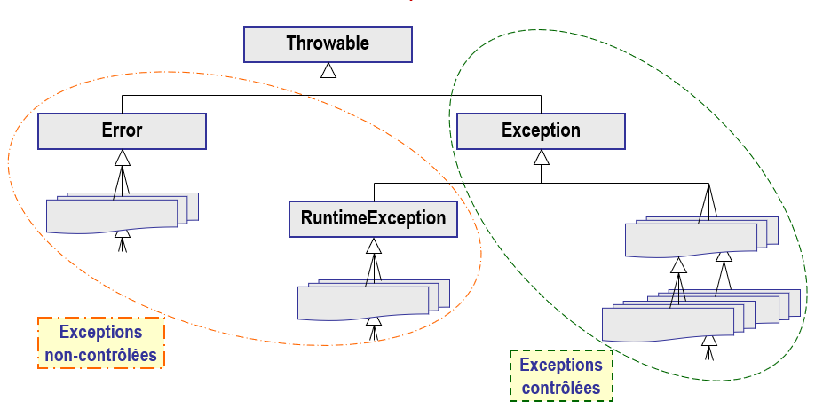

# La classe `Exception`

Une exception est une instance de la classe `Exception` ou d'une classe
héritant de `Exception`.

Différentes méthodes peuvent être utilisées dans le traitement d'une
exception (bloc `catch`) afin d'obtenir plus d'informations sur la nature de
l'exception :
- `getMessage()` : le message associé à l'exception (String)
- `toString()` : le nom de l'exception suivi du message associé (String)
- `printStackTrace()` : affiche en console le nom de l'exception, le message
  associé et l'état de la pile des appels qui ont conduit au traitement de
  l'exception.
- ...

## Hiérarchie des exceptions

La hiérarchie des classes représentant des exceptions est la suivante :

Toutes les exceptions sont des sous-classes de la classe de base `Throwable`.
Il existe trois sous-classes pré-définies : `Error`, `Exception` et
`RuntimeException`.

- `Error` : Elle représente généralement des erreurs sévères qui surviennent
  dans la machine virtuelle. Le langage n'impose pas que ces exceptions soient
  traitées (exceptions non-contrôlées) car elles ne devraient pas survenir
  dans un environnement sain (exemple : `OutOfMemoryError`,
  `StackOverflowError`, ...).
- `RuntimeException` : Il s'agit d'une sous-classe particulière de
  `Exception` qui représente des erreurs détectées par la machine virtuelle
  durant l'exécution de l'application, par exemple
  `NullPointerException`. Le langage n'impose pas qu'elles soient traitées
  par les applications (exceptions non-contrôlées) mais le traitement est
  possible avec un bloc `try` / `catch` pour prendre les mesures nécessaires
  (exemple : `ArithmeticException`, `ArrayIndexOutOfBoudsException`).
- `Exception` : Elle représente la classe de base de la plupart des exceptions
  qui sont générées (`throw`) et traitées (`catch`) dans les applications
  (exceptions contrôlées). Le langage impose que les exceptions contrôlées
  (qui ne sont pas une sous-classe de `RuntimeException`) soient traitées
  (`try`/`catch`) ou propagées (mot-clé `throws` indiquant la délégation au
  niveau supérieur).

En bref, les **exceptions non-contrôlées** peuvent ou non être traitées par
le programmeur, sans erreur à la compilation. S'il n'y a pas de traitement,
elles remontent par propagation jusqu'à la méthode `main()` interrompant
l'application.

Par contre, les **exceptions contrôlées** doivent être traitées (clause
`catch`) ou annoncées pour être traitées à un niveau supérieur (`throws`).
Elles ne peuvent pas être ignorées et le compilateur génère une erreur dans
ce cas.

## Exemple
Lancez le programme "Main.java" et observez le résultat.

# Exercice
Après avoir étudié les points présentés ci-dessus, répondez à la question
ci-dessous.