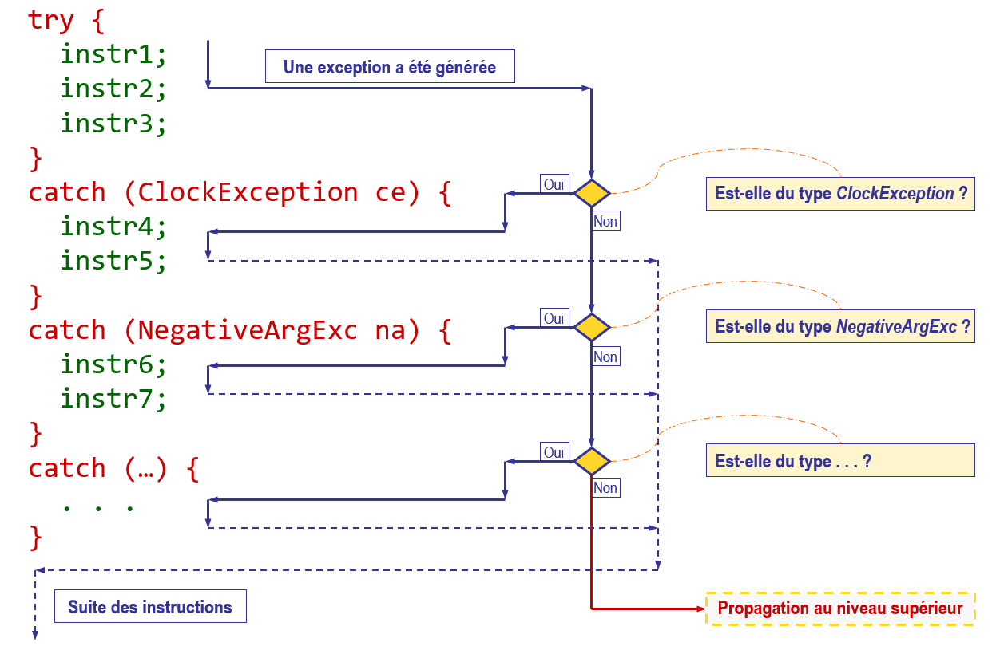

# Capturer et traiter une exception

## `try` and `catch`
Pour capturer et traiter les exceptions pouvant être levées, le bloc `try`
/ `catch` est utilisé, selon la syntaxe :
```
try {
    // Instructions that can throw exceptions
} catch (ExceptionType01 e) {
    // Catch exceptions of type `ExceptionType01` or its subtypes
} catch (ExceptionType02 e) {
    // Catch exceptions of type `ExceptionType02` or its subtypes
} catch (ExceptionType03 | ExceptionType04 e) {
    // Catch exceptions of type `ExceptionType03` or `ExceptionType04` or 
    // their subtypes
}
```

Note : Il est possible de traiter plusieurs types d'exceptions dans une seule
clause `catch` en utilisant le séparateur `|` (ligne 23).

Lorsqu'une exception est générée, chaque `catch` est vérifié. Si l'exception
est une exception du type exprimé par le `catch`, les instructions du
`catch` concerné sont effectuées, suivies par les instructions se trouvant
après le bloc `try` / `catch`.

## Propagation d'une exception
Lorsqu'aucun `catch` n'attrape l'exception parce qu'il s'agit d'un type non
traité, l'exception est propagée au niveau supérieur jusqu'à arriver à la
méthode `main`. Si aucun `catch` n'attrape l'exception dans la méthode
`main`, le programme stoppe avec l'indication de la `stack trace`
(c'est-à-dire la pile d'appels des méthodes ayant mené à la levée de
l'exception).

## Représentation de l'exécution des `try` / `catch` :
<div>

</div>

## Traitement de l'exception
Dans le programme "Main.java", seuls des prints sont effectués dans le bloc
`catch`, ce qui est rarement une bonne solution de gestion d'exception dans
un programme réel. En réalité, les exceptions sont souvent traitées ainsi :
- Régler le problème et recommencer le traitement → idéal, mais pas toujours
  possible.
- Faire autre chose à la place (algorithme de substitution).
- Quitter l'application après affichage d'un message ou écriture dans un
  fichier log.
- Regénérer l'exception après avoir effectué certaines opérations.
- Générer une nouvelle exception après avoir éventuellement effectué certaines
  opérations.
- Pour une fonction, retourner une valeur spéciale ou par défaut ou la
  terminer si elle n'a pas de valeur de retour.

## Exemple
Dans le programme "Main.java", la méthode `div` lève une `ArithmeticException`
dans le cas d'une division par `0`. La méthode `getValue` lève une
`ArrayIndexOutOfBoundsException` lors d'un accès à un index
_out of bounds_ d'un élément du tableau et une `NullPointerException` si le
tableau est `null`.

Commentez et décommentez à votre guise les lignes 14 à 20 pour comprendre quelle
exception est levée et comment elle est traitée.

# Exercice
Après avoir étudié les points présentés ci-dessus, répondez à la question
ci-dessous.
