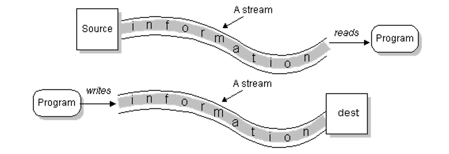
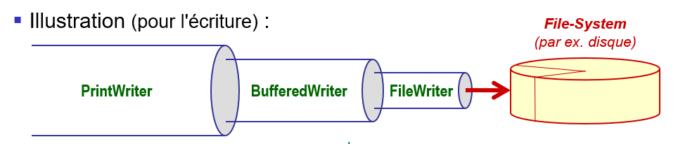

# Entrée/sorties

Les entrées/sorties permettent à un programme de communiquer avec certains
périphériques. Typiquement pour :
- lire et écrire sur la console
- accéder aux fichiers et répertoires des disques
- communiquer avec d'autres applications

## Flux (Stream)
Un flux (stream) caractérise un chemin de communication entre une **source** 
d'information et sa **destination**. L'accès aux informations s'effectue de 
manière séquentielle.

<div>

</div>

## Flux binaires et de caractères
Les bibliothèques Java distinguent deux types de flux : 
- Les **flux binaires** (byte stream) qui peuvent représenter des données 
  quelconques (nombres, données structurées, sons, images, etc.)
- Les **flux de caractères** (character stream) qui représentent des chaînes de 
  caractères au format Unicode.

## Utilisation des flux
La communication avec un flux comprend trois phases :
- L'ouverture du flux
- La lecture ou l'écriture (en général dans une boucle `for` ou `while`)
- La fermeture du flux

Pour manipuler des fichiers, il faut noter que :
- La classe `FileReader` (couche de base) comporte les méthodes élémentaires
  pour lire le flux depuis le système de fichiers.
- La classe `FileWriter` (couche de base) comporte les méthodes élémentaires
  pour écrire le flux sur le système de fichiers.

Pour lire et écrire des fichiers texte, il est toutefois commun d'enrober les 
couches de base avec des outils de plus haut niveau (mémoire tampon, 
conversion de bytes versus caractères, découpage en ligne / retours à la ligne, 
etc.)

C'est ainsi que la figure ci-dessous montre un exemple de tous les composants 
nécessaires lors d'une écriture sur un fichier.
<div>

</div>

En général, cela se réalise de la manière suivante :
```
try {
  // Opening
  String f = "C:\\Temp\\Test.txt";
  PrintWriter p = new PrintWriter(new BufferedWriter(new FileWriter(f)));

  // Writing
  p.print("Hello");
} catch (IOException e) {

} finally {
  // Closing
  p.close();
}
```


## Utilisation du _try-resource_
Avec ce mécanisme, on peut déclarer une ou plusieurs ressources dans le 
`try`. Cette déclaration s'assure que toutes les ressources sont bien 
fermées à la fin du bloc  `try`. Cela évite d'avoir à utiliser un bloc
`finally`. [Plus d'info](https://docs.oracle.com/javase/tutorial/essential/exceptions/tryResourceClose.html)   

## Importation des paquetages
Dans le fichier "Main.java", la première ligne comprend l'instruction suivante : 
```
import java.io.*;
```
Cette instruction est requise afin de rendre visible toutes les classes 
contenues dans le paquetage `java.io` dans le programme "Main.java". Le 
paquetage `java.io` contient la plupart des classes d'entrées/sorties.

Note : La plupart des opérations d'entrée/sorties risquent de générer des 
exceptions du type `IOException` et famille. Il faut éviter de mettre des 
`try`/`catch` à chaque ligne. En effet, grâce au mécanisme des exceptions, 
il est possible de concentrer le traitement à un seul ou quelques endroits 
bien choisis. 

## Exemple
Dans le programme "Main.java", une réalisation d'un programme capable
d'ouvrir le fichier `"input.txt"` en mode lecture et le fichier `"output.txt"`
en mode écriture est donnée. Dans ce programme, le contenu de `"input.txt"`
est copié dans le fichier `"output.txt"`. Vous pouvez vérifier le résultat
dans ce fichier.

# Exercice
Après avoir étudié les points présentés ci-dessus, répondez à la question
ci-dessous. 
