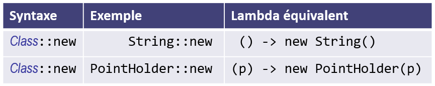

# Les références de constructeurs

Les **références de constructeurs** sont semblables aux références de 
méthodes à la différence que le nom de la méthode est `new`. Ils servent à 
instancier une interface fonctionnelle avec un constructeur compatible avec 
le contexte d'utilisation. Dès lors, la syntaxe est `Class::new`.

# Exemple
La classe `Main` illustre la création d'instances de `String` et de 
`Player` grâce à la référence de constructeurs. 