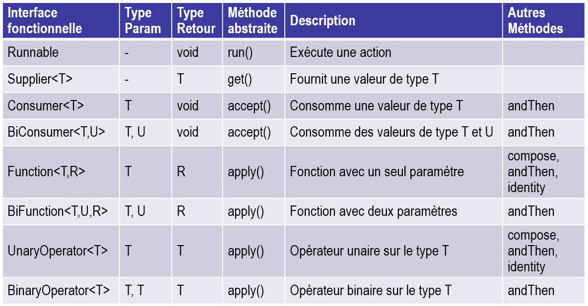
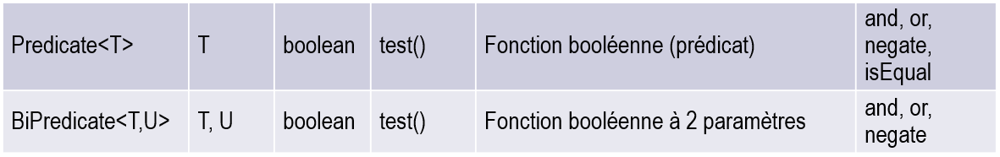

# Interfaces fonctionnelles pré-définies

Les interfaces fonctionnelles (interface ne comportant qu'une seule méthode 
d'instance abstraite) jouent un rôle important en lien avec les expressions 
lambdas. Plusieurs de ces interfaces sont prédéfinies dans le langage Java, 
notamment dans le package `java.util.function`. Voici quelques exemples :

# Exemple
Le programme "Main.java" illustre la réalisation et l'utilisation des 
interfaces fonctionnelles `Runnable`, `Supplier`, `Consumer`, `BiConsumer` 
et `BiFunction`. Comprenez le code et exécutez le programme en observant le 
résultat produit dans la console.