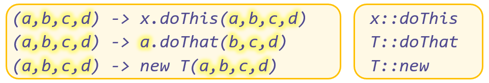
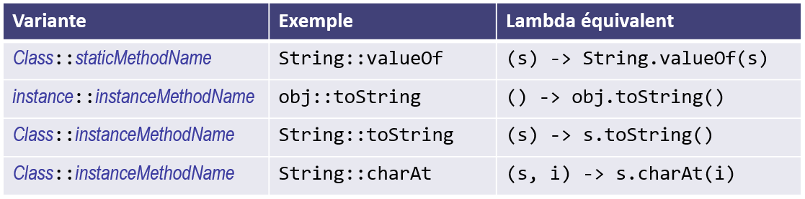

# Références de méthodes

## Définition
Une méthode existante peut être utilisée en tant qu'implémentation de la 
méthode abstraite d'une interface fonctionnelle. On définit pour cela une 
**référence de méthode** avec l'opérateur `::`. Dans ces cas, l'expression 
lambda se résume exactement à une invocation de méthode (avec juste une 
redirection des paramètres). Par exemple :

Les références de méthodes représentent une alternative aux expressions 
lambda dans le cas où il n'y a qu'une seule et unique méthode à exécuter. 
Cela améliore la lisibilité et clarté du code.

## Variantes
Il existe trois variantes :
- `Class::staticMethodName`
- `Instance::instanceMethodName`
- `Class::instanceMethodName`

Voici les différentes variantes possibles avec les équivalences en 
expression lambda :

Dans les deux premières variantes, la référence de méthode est équivalente à 
une expression lambda qui fournit les paramètres de la méthode.

Dans la troisième variante (troisième et quatrième exemple), même si on 
mentionne le nom de la classe en préfixe, c'est bien une méthode d'instance 
qui est invoquée. Le premier paramètre de l'expression lambda représente 
l'objet sur lequel la méthode est invoquée.

## Exemples
La classe `Main` illustre l'utilisation des classes concrètes, des classes 
anonymes, des lambda et enfin des références de méthodes. Il faut 
bien comprendre qu'il s'agit simplement de différentes manières d'écrire une 
réalisation d'interface fonctionnelle, en étant de plus en plus concis.

# Exercice
Après avoir étudié attentivement les informations ci-dessus et compris le
code du programme de l'exemple, répondez à la question ci-dessous.