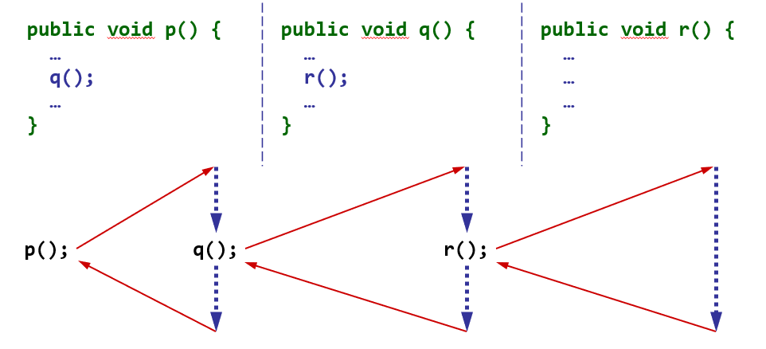

# Appels multiples de méthodes et pile d'appels

Il est possible d'appeler une méthode depuis une autre méthode. Ce 
comportement génère une pile d'appels, ce qui permet de revenir ensuite au 
point d'invocation après l'exécution de la méthode.

Un exemple d'une pile d'appels est illustré par l'image suivante :
<div> 

</div>

## Appels de méthodes comme paramètres

Lors de l'invocation d'une méthode, il est possible de passer comme 
paramètre effectif à la méthode la valeur retournée par l'appel d'une méthode, 
par exemple : 
```
int m1(int b) {
  return b;
}
int m2(int c) {
  return c + 1;
}
...
m2(m1(2));
...
```

# Exemple
Observez le code du programme "Main.java". 

A la ligne 5, la méthode `f` est invoquée avec des paramètres effectifs qui 
sont évalués eux-mêmes en appelant des fonctions. Notez que lorsque 
plusieurs appels sont faits pour évaluer un ou plusieurs paramètres, alors 
ces appels sont effectués de **gauche à droite**. 

En analysant ce programme, déterminez l'ordre des valeurs affichées lorsque 
la fonction `main` est exécutée. Observez attentivement comment les différents 
appels à `f()` sont effectués.