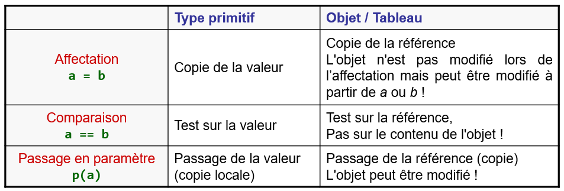

# Notion d'alias

## Rappel : types primitifs et références
Il est utile de rappeler les points suivants :
- **Type primitif** : l'accès à la zone mémoire n'est possible que par une
  seule variable.
- **Type Objet/Tableau** : l'accès à la zone mémoire est possible par plusieurs
  variables puisqu'il s'agit d'une référence et que les références peuvent
  être copiées.

## Références multiples vers un même objet
Cela implique différents comportements dans trois cas :
- **Affectation**
  - Le type primitif est copié.
  - La référence de l'objet est copiée. Deux variables pointent sur le même
    objet. L'objet peut être modifié à partir de l'une ou l'autre variable.
- **Comparaison**
  - Une comparaison des types primitifs teste leur valeur.
  - Une comparaison des types référence teste leur référence. Les
    attributs de l'objet ne sont donc **pas** testés.
- **Passage en paramètre de méthode**
  - Le type primitif est copié et la méthode reçoit une copie de la valeur
    du type primitif.
  - La référence de l'objet est copiée. La méthode reçoit donc une
    copie de la référence vers l'objet et l'objet peut être modifié
    dans le corps de la méthode. Si la référence vers l'objet elle-même
    est modifiée, alors cela n'a pas d'influence sur l'objet passé en
    paramètre.

## Exemple : la classe `Main`
Observez bien le code dans `main()` ainsi que les résultats obtenus lorsque
le code est lancé.

Voici un tableau résumé :

# Exercice
Après avoir étudié les points présentés ci-dessus, identifiez les affirmations
correctes parmi les suivantes.