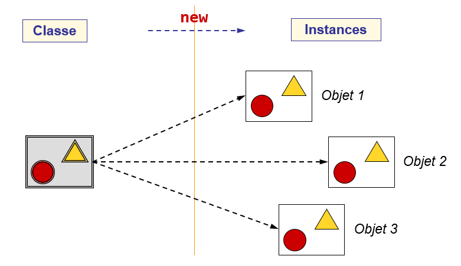

# Introduction aux objets et aux classes

Jusqu'à maintenant, nous avons principalement manipulé des données et écrit des 
méthodes. Il s'agit de **la programmation procédurale** où le programme est 
divisé en petites parties en recourant à des méthodes.

Un autre paradigme est **la programmation orientée objet** où le programme est
structuré autour d'un ensemble d'objets qui communiquent en s'échangeant des 
messages.

Les objets sont des instances de **classe** et une classe peut être 
considérée comme un moule (ou un plan) permettant de créer des **objets** 
(instances de classe) qui ont des propriétés similaires, mais qui ont tous 
leur identité propre (indépendance).

#