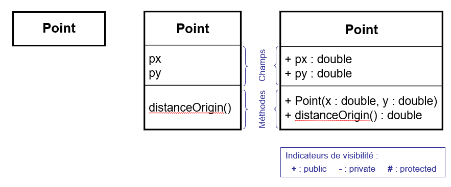

# Notation _UML_ des classes

Dans le langage de modélisation _UML_ (_Unified Modeling Language_), les 
classes sont représentées graphiquement sous la forme de rectangles 
comprenant le nom de la classe et éventuellement le nom des attributs, des 
constructeurs et des méthodes.

Comme illustré dans la représentation ci-dessous, différents niveaux de détails 
sont possibles allant à la seule indication du nom de la classe (à gauche) à 
l'expression de toutes les informations (à droite). Notez que dans la figure 
de droite, les accès aux différents membres sont également documentés 
(`public`, `private`, `protected`).

# Représentations _UML_ de la classe `Point`

