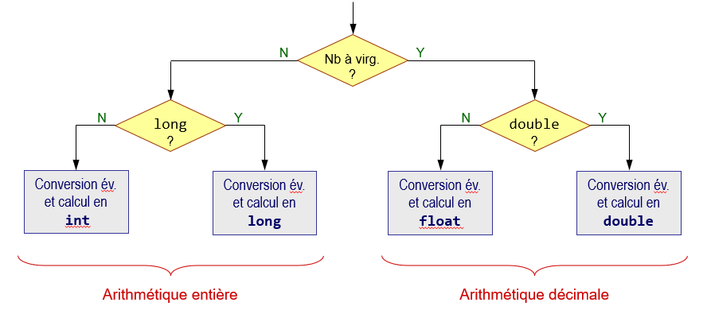

# Opérateurs arithmétiques avec des entiers et des nombres à virgule flottante

Lorsqu'une expression comprend à la fois des opérandes de type entier et à 
virgule flottante, des conversions implicites sont effectuées. Dans ce cas, les 
expressions sont évaluées dans le type selon le diagramme ci-dessous :

Il est important de comprendre l'ordre d'évaluation des opérations dans une 
expression afin de bien comprendre dans quel type sera évaluée chaque partie 
d'une expression complexe. 

# Exercice 
Dans le but de bien comprendre l'ordre d'évaluation dans une expression, 
complétez le code correspondant à l'évaluation des expressions dans la méthode 
`main`.
