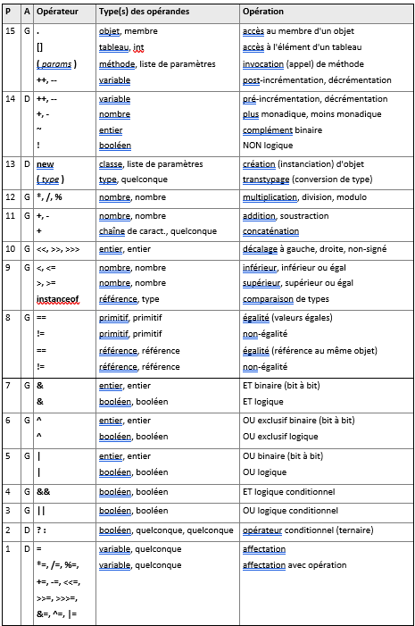
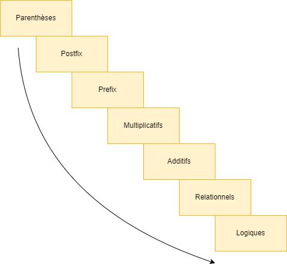

# Le tableau de précédence et associativité

Le tableau suivant présente la définition de toutes les précédences :

## Les éléments essentiels

Le but n'est pas d'apprendre ce tableau par cœur, mais plutôt de mémoriser 
les points importants :

- Les opérateurs multiplicatifs (`*`, `/`, `%`) ont une précédence plus 
  élevée que les opérateurs additifs (`+`, `-`) , ce qui signifie par exemple 
  que l'expression `2 + 3 * 4` est évaluée comme `2 + (3 * 4)`.
- Les opérateurs arithmétiques/logiques unaires (`++`, `--`, `+`, `-`, `~`, 
  `!`) ont une précédence plus élevée que les opérateurs _binaires_.
- L'opérateur d'affectation a la plus faible précédence et une associativité 
  depuis la droite. Ceci signifie que dans l'expression `a = b = c + d`, 
  l'expression `c + d` est évaluée en premier. Le résultat de cette 
  expression est affecté à la variable `b`, pour finir par une affectation 
  de la valeur de `b` à la variable `a`.
- L'ordre général des familles d'opérateurs peut être visualisé dans la 
  figure ci-dessous :

# Exercice
Vous devez compléter les parties manquantes du programme "Main.java" selon
les instructions.