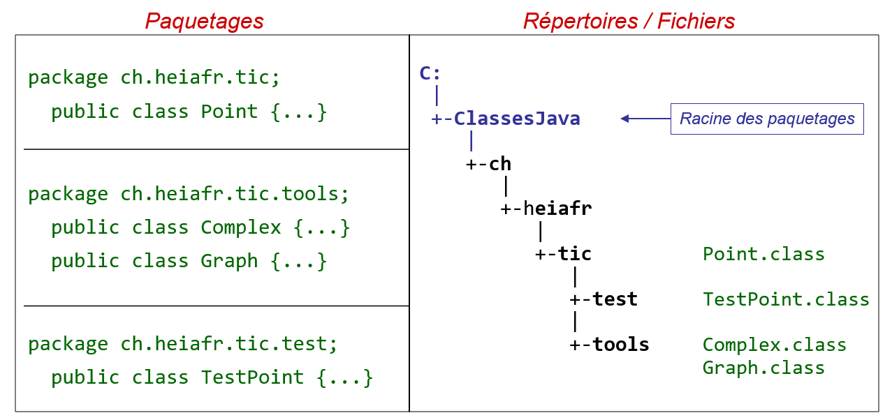

# Paquetages et unité de compilation

La hiérarchie des répertoires du disque dans lesquels sont enregistrés les
fichiers des classes (`.class`) doit correspondre à la hiérarchie des
paquetages. L'image suivante, ainsi que le code, illustre cette notion.

<div>

</div>

## Fichiers ".class" et machine virtuelle
La hiérarchie des fichiers contenant les classes constitue un sous-arbre qui
peut être placé n'importe où dans l'arborescence générale du disque. Le
paramètre `classpath` indique à la machine virtuelle Java la liste des
répertoires (racines) dans lesquels se trouvent les classes.

Si vous démarrez un programme Java sur la ligne de commande, vous pouvez
spécifier cette liste de répertoire ainsi :
```
java -classpath .;C:\ClassesJava;G:\Info\Lib ...
```

Dans Intellij Idea, le projet est automatiquement inclus dans le `classpath`.

# Résumé
En résumé, les unités de compilation (fichiers `.java`) doivent respecter la
structure suivante :
```
// Commentaires possibles
package ...;
// Commentaires possibles
import ...;
// Commentaires possibles
public class ... {
}
```
C'est-à-dire :
- aucune ou une instruction `package`.
- aucune, une ou plusieurs instructions `import`.
- une ou plusieurs définitions de classes (`class`), d'interfaces ou de
  classes internes (mais une seule classe ou interface `public` au premier
  niveau).

Ces éléments (`package`, `import`, `class`) peuvent naturellement être
entourés de commentaires, mais ils doivent impérativement apparaître dans
l'ordre mentionné ci-dessus.

## Exercice
Après avoir étudié les points présentés ci-dessus,
identifiez l'affirmation correcte parmi les propositions suivantes.