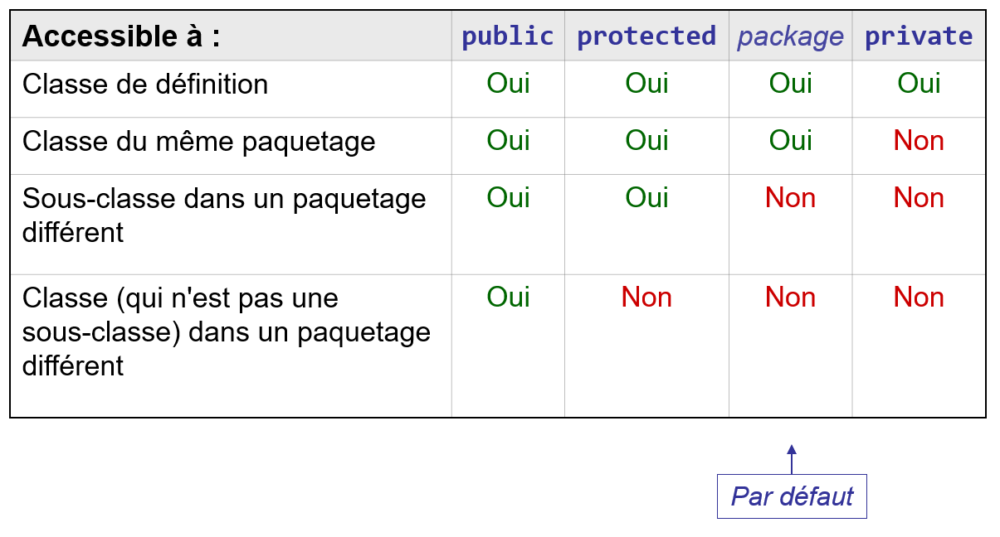

# Visibilité

Tous les attributs et méthodes d'une classe peuvent être utilisés dans le
corps de la classe elle-même en utilisant leurs noms simples. Cependant, le
langage Java permet de spécifier des restrictions d'accès aux membres
(attributs ou méthodes) d'une classe en dehors de cette classe (appelée aussi
**classe de définition** ou **classe de déclaration**).

## Modificateurs d'accès
Le **contrôle d'accès** aux membres s'effectue à l'aide de différents
mots-clés (modificateurs) qui peuvent précéder la déclaration des champs et des
méthodes.

Le mode d'accès par défaut (si l'on n'indique aucun mot-clé de contrôle
d'accès dans la déclaration) est appelé _package_ ou _friendly_.

Les modificateurs qui contrôlent l'accès aux membres sont les suivants :
- `public` : Accessible à toutes les classes de tous les paquetages.
- `protected` : Accessible aux classes dérivées (sous-classes) ainsi qu'aux
  classes du même paquetage. Il sera décrit dans un cours ultérieur, dans
  le cadre de l'héritage.
- aucun mot-clé : Accessible à toutes les classes du même paquetage. Il
  s'agit du mode d'accès par défaut _package_ ou _friendly_.
- `private` : Accessible seulement aux autres membres de la même classe.

## Modificateur `public` pour les classes
Le modificateur `public` peut également être utilisé dans la déclaration des
classes. Il indique que la classe est accessible partout où le paquetage est
accessible via `import`. Sans lui, la classe n'est accessible qu'au sein de
son paquetage (mode d'accès par défaut _package_).

La figure suivante synthétise les règles d'accès aux membres d'une classe
(attributs et méthodes).

# Exercice
Après avoir étudié les points présentés ci-dessus ainsi que les classes `A`,
`B` et `Main`, identifiez l'affirmation correcte parmi les propositions suivantes.