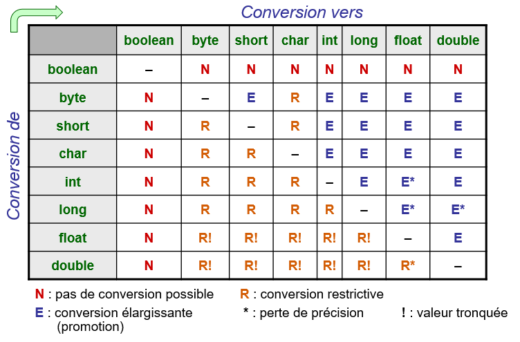

# Tableaux récapitulatifs

## Toutes les conversions entre types primitifs
L'ensemble des conversions entre types primitifs est documenté dans le 
tableau ci-dessous. Observez les conversions dites élargissantes (ne 
nécessitant pas de transtypage) et les conversions dites restrictives 
(nécessitant un transtypage) : 

## Type des expressions
Lorsqu'une expression contient des opérandes de différents types primitifs, 
l'expression est évaluée dans un type qui correspond au diagramme ci-dessous.
Cela signifie par exemple qu'une addition d'une variable de type 
<code>byte</code> et d'une variable de type 
<code>short</code> sera évaluée comme une expression de type 
<code>int</code>

# Exemple
Dans le code du programme "Main.java", vous devez comprendre les notions de 
conversion implicite et explicite, ainsi que de _underflow_/_overflow_. 
