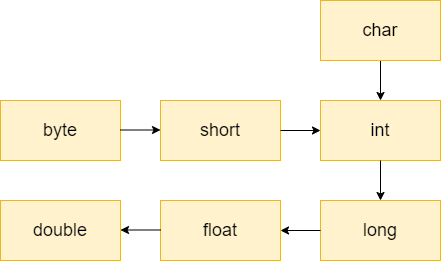

# Transtypage implicite et explicite

Avant d'étudier en détails toutes les conversions entre types primitifs, il 
est utile de comprendre le concept de transtypage implicite et explicite.

En Java, il existe deux formes de transtypage ou conversion entre types
primitifs, la forme **implicite** et la forme **explicite**. Dans le cas d'un
transtypage **implicite**, le compilateur accomplit
automatiquement une conversion de type, alors qu'un transtypage
**explicite** doit être effectué par le programmeur.

## Transtypage implicite

Le compilateur effectue automatiquement une conversion lorsque le type cible
est plus "grand" que le type source. Le schéma ci-dessous illustre tous les
scénarios de transtypage implicite :

Ce diagramme n'expose pas toutes les conversions possibles, mais présente
un moyen simple permettant de vérifier si un transtypage implicite
est possible. Une conversion d'un type `int` à un type `double` est par exemple
possible sans autre conversion intermédiaire.

Dans tous les cas indiqués ci-dessus, il n'y a pas de perte d'information,
car le type cible permet de représenter toutes les valeurs du type source.
Toutefois, dans certains cas particuliers, il peut y avoir une perte de
précision lors de la conversion d'un type `int` ou `long` vers un type à virgule
flottante.

Voici quelques exemples de telles conversions implicites :

<pre><code class="language-java">
int intVal = 8;
long longVal = intVal + 1;  // implicit casting from int to long
double doubleVal = longVal; // implicit casting from long to double
</code></pre>

## Transtypage explicite

Lorsque le type cible est plus "petit" que le type source, alors le
programmeur doit explicitement ajouter une opération de transtypage. Comme
une partie de l'information peut être perdue lors de cette conversion, le
compilateur refusera la conversion si celle-ci n'est pas exprimée
explicitement.

Toutes les conversions qui ne sont pas possibles dans le diagramme présenté
ci-dessus exigent un transtypage explicite, comme `double` ->
`int` ou `long` -> `int`. Quelques exemples exigeant un transtypage explicite :

<pre><code class="language-java">
double d = 2.00003;
long l =  (long) d; // it loses the fractional part
int i = (int) l;    // explicit type casting required
int val = (int) (1 + 2L + 3); // requires explicit casting because the expression is evaluated as long
</code></pre> 

Lorsqu'une conversion explicite a lieu, il est possible qu'un
_overflow_ ou un _underflow_ survienne. En effet, lorsque la valeur du type
source est trop grande ou trop petite pour être représentée dans le type
cible, alors la valeur ne peut pas être représentée et la valeur originale
est perdue. Un exemple est donné ci-dessous :

<pre><code class="language-java">
long longValue = Long.MAX_VALUE;
int intValue = (int) longValue; // an int variable can't store this value, the result is -1
longValue = (long) Integer.MAX_VALUE + 1;
intValue = (int) longValue; // an int variable can't store this value, the result is Integer.MIN_VALUE
</code></pre>

#