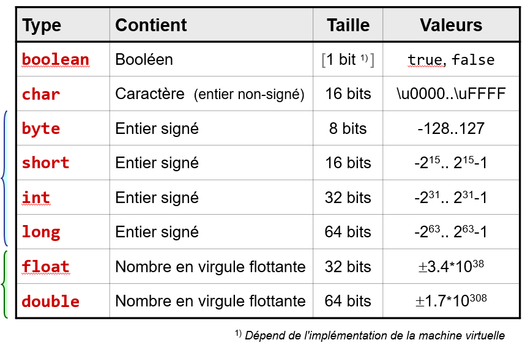

# Les types primitifs en Java

Java permet d'utiliser deux types de données différents : les types dits 
**primitifs** et les types dits **référence**.

Les types **primitifs** sont constitués des :

- types représentant des _entiers_ ;
- types représentant des _nombres à virgule_ ;
- type représentant les _caractères_ ;
- type représentant une valeur _booléenne_.

Dans le programme ci-joint, une variable de chaque type du tableau est créée et
sa valeur affichée à l'écran. Observez
le résultat sur la console.

Notez les points qui ne sont pas clairs pour vous dans cet exemple. Il sera
probablement utile que ces points deviennent
clairs dans les prochaines leçons.

  L'ensemble des types primitifs est documenté dans le tableau ci-dessous : 

#