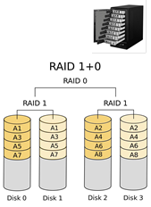

# Exercice 3 de la série 19

En informatique, un RAID (ou "Redundant Array of Independent Disks") combine 
plusieurs disques en un seul mais plus fiable ou avec plus de capacité de 
stockage. Il existe plusieurs types de RAID, dont voici les plus simples : 
- Un RAID 0 combine n disques et offre n fois plus de capacité, mais si un 
  seul de ses disques tombe en panne, alors le RAID 0 tombe en panne.
- Un RAID 1 (miroir) combine lui aussi n disques, mais n’offre que la 
  capacité d’un seul disque; par contre il est plus fiable : un RAID 1 n’est 
  en panne que si les n disques qui le composent sont tous en panne.  

On peut former une combinaison de RAID 1 et RAID 0 qui permet un gain à la 
fois de capacité et de fiabilité (ce qu'on appelle un RAID 1+0 ou RAID 10). 
Cette construction est illustrée dans l'image ci-dessous :

Il existe bien sûr différentes manières d'adresser la mémoire de chaque disque et dans
notre modélisation (rudimentaire), les disques représentent un tableau de 
bytes. Voici comment seront répartis les indices de ces cellules-mémoire 
(exemple donné pour un RAID 0 avec 3 disques) : 

Raid0: 
  - {00,03,06,09,12}  ← member 0
  - {01,04,07,10,13}  ← member 1
  - {02,05,08,11,14}  ← member 2

Raid1: 
  - {00,01,02,03,04}  ← member 0
  - {00,01,02,03,04}  ← member 1
  - {00,01,02,03,04}  ← member 2

---
**&#9432;**
Afin de tester votre solution correctement, suivez attentivement les
instructions données ci-dessous.
---

## Instructions :
- Etudier la modélisation fournie dans le code existant, puis réaliser les 
  classes suivantes :
  - `InvalidIndexException` : cette classe modèlise une exception qui doit 
    être levée lors d'un accès à un indice invalide pour `Raid0` ou `Raid1`. 
    Vous devez déterminer la classe mère appropriée pour cette classe.
  - `Raid0` : cette classe modèlise un RAID de type 0.
  - `Raid1` : cette classe modèlise un RAID de type 1.

- Un développeur doit être attentif aux aspects de sécurité, notamment en 
  essayant d'imaginer comment un "adversaire" pourrait détourner un 
  programme/service pour provoquer des comportements non souhaités. Dans la 
  classe `FunWithDisks`, nous construisons un disque "bizarre" avec la 
  méthode `mysteriousDisks`. Imaginez les conséquences qui pourraient 
  survenir avec cette configuration de disques. Ensuite (un peu plus 
  difficile), nous décrivons deux autres comportements étranges et c'est à vous d'imaginer 
  comment créer de tels disques avec les méthodes `strangeCapacityDisk` et 
  `badDisk`.     

- Expliquer (autant que possible) comment il faudrait corriger notre 
  réalisation pour empêcher (partiellement ou totalement ?) les trois 
  problèmes évoqués dans l'exercice précédent.

#