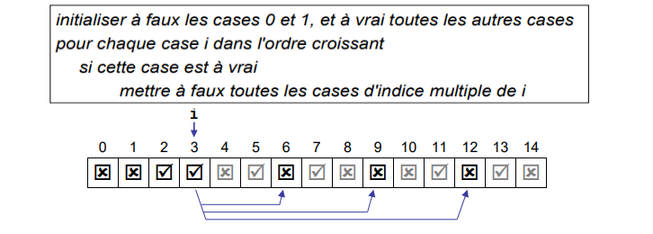

# Exercice 6 de la série 8

Un nombre premier est un entier naturel qui a exactement 2 diviseurs (1 et lui-même).
Écrire une méthode `generatePrimeArray()` qui retourne un tableau de `n` booléens, où
chaque case d'indice `i` indique si `i` est un nombre premier. `n` est un entier qui
devra être passé en paramètre à la fonction.

## Exemple d'algorithme (en pseudo-code) pour remplir ce tableau :

    Un nombre <b>n</b> est premier s'il est divisible uniquement par <b>1</b> et <b>n</b>.  
    Tous les nombres premiers sont supérieurs ou égaux à <b>2</b>.

    Assurez-vous que votre fonction retourne bien un <b>tableau de booléens</b>.  
    Si vos tests échouent, vérifiez le type de retour et la structure de votre tableau.

#