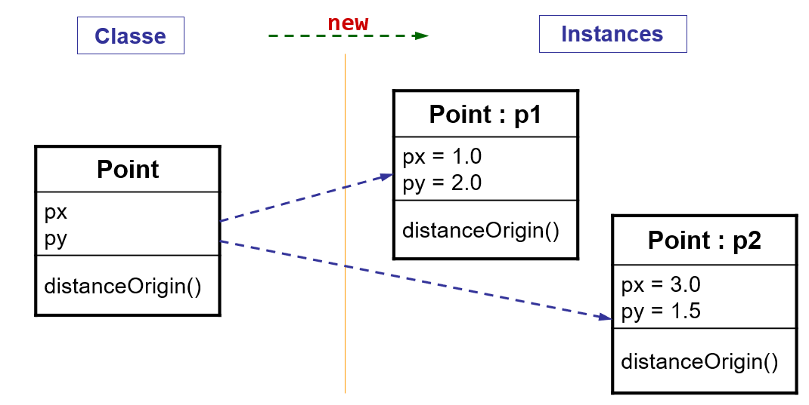
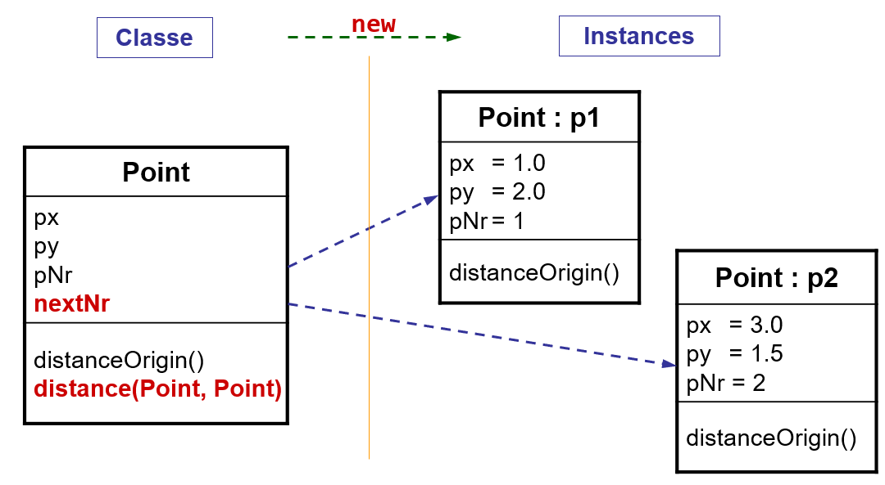
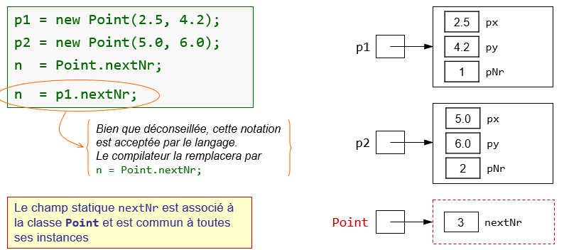

# Membres de classe et modificateur `static`

## Membres d'instance
Par défaut, lors de la création d'un objet (instanciation d'une classe avec
l'opérateur `new`), les membres sont associés (attributs et méthodes) à chacune
des instances de la classe. On les appelle **membres d'instance**.

## Membres statiques
On peut également créer des membres associés à la classe qui sont appelés
**membres de classe** ou **membres statiques**. Pour rendre un membre
statique, on utilise le modificateur `static` devant la déclaration de
l'attribut ou méthode.

Les **membres de classe** ne sont pas associés aux instances (objets) mais
seulement à la classe. Ils sont accessibles par toutes les instances de la
classe (ils sont partagés par toutes les instances).

On peut donc déclarer :
- des attributs statiques (autrement dit attributs de classe)
- des méthodes statiques (autrement dit méthodes de classe)

Les attributs statiques existent et sont accessibles même si on n'a pas créé
d'objets. On les représente donc dans une zone mémoire liée à la classe
commune à toutes les instances de cette classe.

### Méthodes statiques
Les méthodes statiques sont liées à une classe et non pas à une instance (objet)
de la classe.

Dans une méthode statique, on ne peut **pas** faire référence à un attribut
ou une méthode d'instance, car les méthodes statiques ne
s'exécutent pas dans le contexte d'un objet (autrement dit, pour les
méthodes statiques, il n'existe pas de référence `this`).

### Accès aux membres statiques
Pour accéder à un membre statique d'une classe en dehors de cette classe, il
faut préfixer le nom du membre avec le nom de la classe (ou utiliser `import
static ...`).

# Exercice
Observez la classe `Point`. Repérez l'attribut statique `nextNr` et son
utilisation ainsi que la méthode statique `distance()`. Observez leur
utilisation dans la classe `Main`, finalement identifiez les affirmations
correctes ci-dessous.