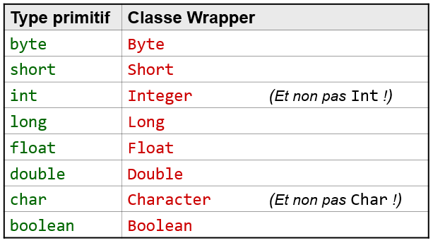

# Wrappers

En Java, pour des raisons d'efficacité, les types primitifs ne sont pas des 
objets. 

Dans certaines circonstances, il peut être utile de pouvoir traiter les 
types primitifs comme des objets (exemple : pour pouvoir les enregistrer 
dans des structures de données abstraites de type _list_, _pile_, _arbre_ 
qui ne manipulent que des objets).

Ainsi, il existe pour chaque type primitif une classe `Wrapper` (classe 
d'emballage) qui permet de convertir une variable de type primitif en un 
objet correspondant.

Les classes `Wrapper` sont déclarées dans le paquetage `java.lang` (et sont 
donc accessibles sans importation explicite).

Les classes `Wrapper` disposent d'un certain nombre de constantes et de 
méthodes (statiques et non-statiques) permettant d'effectuer diverses 
conversions.

A deux exceptions près (`int` et `char`), le nom de la classe Wrapper 
correspond à celui du type primitif avec une majuscule initiale.

Les classes `Wrapper` créent des objets immuables.

# Exercice
La classe `Main` illustre l'utilisation d'un `Wrapper` de type `Float`. 
Après les avoir étudiées, identifiez les affirmations correctes ci-dessous.