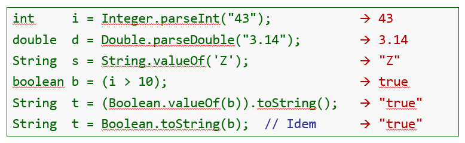

# Opérations sur les chaînes de caractères

Il existe différentes opérations possibles sur les instances de `String` :
- `+` : Permet de concaténer deux `String` ensemble.
- `length()` qui permet de connaître la longueur d'une chaîne de caractères.
- `charAt()` qui permet d'obtenir le caractère situé à la position `n` 
d'une chaîne avec `n` compris dans la plage $[0 ; length - 1]$.
- `substring()`qui retourne une sous-chaîne d'une chaîne de caractères donnée.
  Le premier paramètre indique l'index de lettre de départ (inclusif), tandis que le 
  second paramètre indique l'index de la lettre de fin (exclusif). Dans 
  le cas où aucun deuxième paramètre n'est indiqué, toutes les lettres sont 
  conservées jusqu'à la fin.
- `toUpperCase()` qui transforme le mot en majuscule.
- Conversion entre les valeurs de types primitifs et `String` et vice-versa,
  comme illustré ci-dessous :

# Exemple
Le programme "Main.java" démontre l'utilisation de ces méthodes et des 
conversions.
