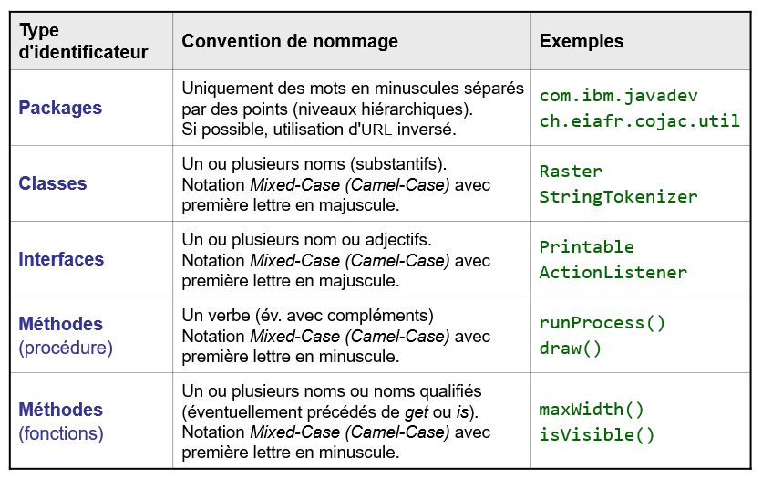
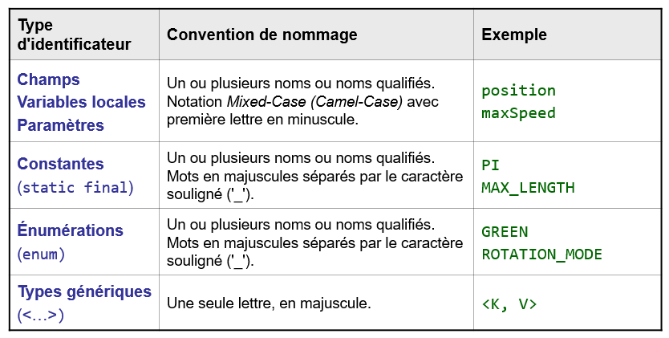

# Bonnes pratiques

## Mise en page

- Ne pas dépasser 80 caractères par ligne.
- Une seule instruction par ligne.
- Décomposer le code des méthodes trop longues.
- Indenter correctement.
- Aligner les instructions lorsque cela a un sens.

## Commentaires

Les commentaires sont une aide précieuse et souvent indispensables. Pour les 
applications d'une certaine envergure, des commentaires de documentation 
devraient précéder chaque classe et chaque membre, en particulier les membres 
`public`.

Mal écrits, les commentaires peuvent augmenter la confusion. Il est inutile 
de mettre des commentaires triviaux tels que :
```
int counter; // Variable compteur de type int
i++;         // i = i + 1;
```

## Choix des identificateurs

D'une manière générale, les identificateurs doivent être auto-descriptifs 
sans être trop longs (< ~30 caractères). 

Les variables temporaires peuvent faire exception à cette règle. Par exemple,
les compteurs de boucle sont déclarés avec un seul caractère (i, j, k, etc.).

Pour les identificateurs composés de plusieurs mots, on adopte généralement 
la notation Camel-Case (exemple : `aMixedCaseIdentifier`).

Pour aller plus dans le détail, les tableaux suivants présentent les 
choix d'identificateurs selon le contexte :

<div>

</div>

<div>

</div>

# Exemples

Observez d'abord la classe `P` et voyez que sa compréhension est difficile. 
Lisez ensuite la classe `Point` qui met en place les bonnes pratiques pour 
faciliter la lecture. La classe `Main` illustre que l'utilisation de l'une 
ou l'autre classe est la même, mais la lecture est plus ou moins facile. 