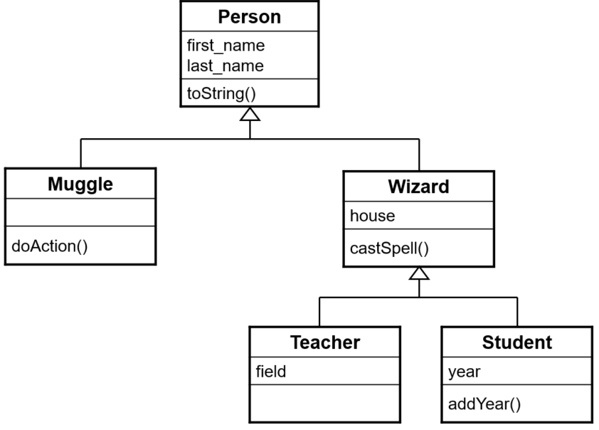

# Chaînage des constructeurs

Un constructeur d'une sous-classe peut faire appel à un constructeur de la
classe parente en utilisant le mot-clé `super(...)` - dans l'appel à `super`
il est donc possible de passer des paramètres. Lorsque ce mot-clé est
utilisé, il doit alors être la première instruction du constructeur.

Si le mot-clé `super` n'est pas utilisé, une invocation du constructeur par
défaut de la super-classe est automatiquement ajoutée. Cependant, si un tel
constructeur n'existe pas, une erreur est générée à la compilation. Ainsi,
cela garantit que tous les éléments des classes parentes sont initialisés avant
la création de l'objet même.

Le diagramme de classe de l'exemple fourni est illustré par l'image suivante :

## Exemple
Nous sommes toujours dans le monde de Harry Potter, mais nous avons désormais
des professeurs et des étudiants en plus, qui sont des sous-classes de `Wizard`.
La classe `Main` initialise un `Muggle`, un `Student`, un `Teacher` et un
`Wizard`. Observez attentivement le chaînage des constructeurs (vous pouvez
démarrer le programme en mode debug et avancer pas à pas dans la
construction des objets).

# Exercice
Après avoir étudié attentivement les informations ci-dessus et compris le
code des différentes classes, identifiez les affirmations
correctes ci-dessous.