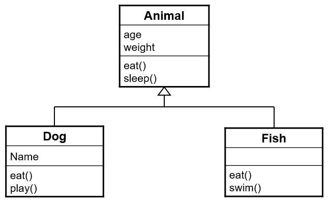

# Polymorphisme

## Illustration par un exemple : Animaux 

Soit le diagramme de classe suivant qui représente l'exemple fourni.

<div>

</div>

Ainsi :
- `Dog` et `Fish` sont des sous classes d'`Animal`
- `Animal` est la classe parente de `Dog` et `Fish`

Concernant `Dog`, il :
- hérite des membres d'`Animal` (`age`, `weight`, `sleep()`)
- ajoute l'attribut `name`
- ajoute la méthode `play()`
- redéfinit la méthode `eat()`

Concernant `Fish`, il 
- hérite des membres d'`Animal` (`age`, `weight`, `sleep()`)
- ajoute la méthode `swim()`
- redéfinit la méthode `eat()`

Si on écrit le code suivant : 
```
Dog milou = new Dog(3, 7, "Milou");
milou.eat();
```
C'est la méthode `eat()` de la classe `Dog` qui est invoquée (puisque `milou` 
est de type `Dog` et que cette méthode est redéfinie dans cette classe). Si 
la méthode n'était pas redéfinie, ce serait la méthode `eat()` de la classe 
`Animal` qui serait invoquée.

Avec le code suivant :
Soit le code suivant :
```
Animal toutou = new Dog(4, 8, "Toutou");
toutou.eat();
```
Dans cet exemple, c'est toujours la méthode `eat()` de la classe `Dog` qui est 
invoquée. C'est le **type effectif** de l'objet référencé qui détermine la 
méthode qui est appelée.

## Définition du _late binding_

En Java, la détermination de la méthode à invoquer n'est **pas** effectuée lors 
de la **compilation**. C'est seulement à l'**exécution** que la machine 
virtuelle détermine la méthode à invoquer selon le **type effectif** de 
l'objet référencé à ce moment-là. Ce mécanisme s'appelle _Recherche dynamique de 
méthode_ (_late binding_ / _dynamic binding_). Ce mécanisme de recherche 
dynamique sert de base à la mise en œuvre de la propriété appelée 
**polymorphisme**.

## Polymorphisme
On peut définir le **polymorphisme** comme la propriété permettant à un 
programme de réagir de manière différenciée à l'envoi d'un même message 
(invocation de méthode) en fonction des objets qui reçoivent ce message. Il 
s'agit d'une aptitude d'adaptation dynamique du comportement selon les 
objets en présence. 

Note : Avec l'encapsulation et l'héritage, le polymorphisme est une des 
propriétés essentielles de la programmation orientée objet.

# Exemple : Ménagerie
Il est possible d'enregistrer et de manipuler une collection d'animaux 
(ménagerie). Ainsi, il est possible d'écrire une méthode `feed()` qui nourrit 
tous les animaux de la ménagerie (ligne 21 de la classe `Main`). Sur la base 
du contenu du tableau `menagerie`, la méthode `feed()` appelle les 
différentes méthodes `eat()` des différentes classes. Le polymorphisme fait 
en sorte que le message `eat()` soit interprété de manière appropriée selon 
les objets qui le reçoivent.