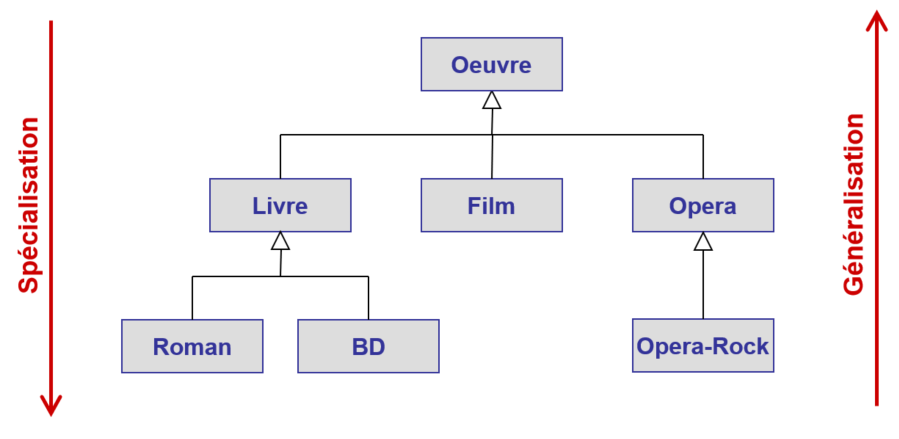
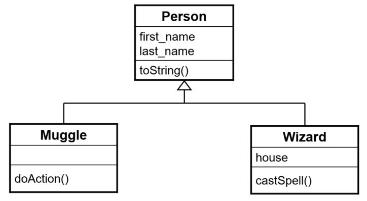

# Relations entre classes

Il existe deux types de relations entre classes : la relation "est un..." et 
la relation "a un...".

## Relation "est un..."

L'**héritage** entre une sous-classe et sa classe parente est caractérisé par 
une relation de type "**est un...**" (ou autrement dit "est une sorte de..."). 
Par exemple : une voiture **est un** véhicule, un camion **est un** véhicule. 
Attention : l'inverse n'est pas toujours vrai, car un véhicule n'est pas 
nécessairement une voiture puisqu'il peut être un camion.

Une sous-classe crée une **spécialisation** de la classe parente. A 
l'inverse, on parle de **généralisation** lorsqu'on passe des sous-classes à 
leur classe parente. Ceci est illustré par l'image suivante :

<div>

</div>

## Relation "a un..."

La **composition** est une relation de type "**a un...**" (ou autrement dit 
"possède un...", "est composé de...", "contient..."). Par exemple, une 
voiture possède un moteur, une voiture a un propriétaire. 

En Java, les relations de composition sont réalisées en créant dans la classe 
_contenant_ une référence vers un objet de la classe _contenu_.
```
// The car is a vehicle -> inheritance
public class Car extends Vehicle {
    private Person owner;   // A car has an owner -> composition
    private Engine engine;  // A car has an engine -> composition
}
```

## Exemple

L'exemple fourni permet de modéliser les personnages du monde de Harry Potter.
Une personne a un nom et un prénom. Chaque personne peut soit être un moldu 
(`Muggle`) ou un magicien (`Wizard`). Les moldus peuvent effectuer des 
actions (`doAction`) d'après une liste prédéfinie. Les magiciens, eux, peuvent 
lancer des sorts (`castSpell`) d'après une liste prédéfinie.

<div>

</div>

# Exercice
Après avoir étudié attentivement les informations ci-dessus et compris le
code des classes `Muggle`, `Person` et `Wizard`, identifiez les affirmations
correctes ci-dessous.