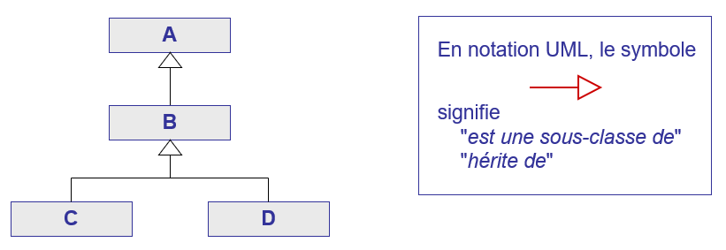
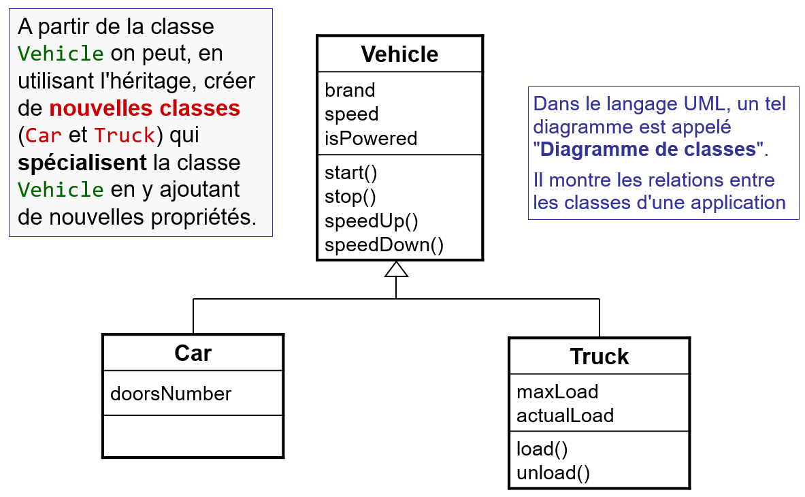

# Sous-classe et héritage

## Définition

L'**héritage** est une propriété essentielle de la programmation orientée 
objet. Il permet à une **sous-classe** (classe qui hérite) d'étendre les 
propriétés de la **classe parente** (super-classe) tout en héritant des 
attributs et des méthodes de cette classe parente.

En Java, une classe ne peut hériter que d'une seule classe parente. Il 
s'agit d'**héritage simple** par opposition à l'héritage multiple (qui 
permet à une classe d'hériter de plusieurs classes parentes).

L'héritage induit une relation arborescente entre les classes comme montré 
par l'image suivante :

C'est ainsi que :
- La classe `A` est la classe parente (super-classe) de `B`.
- La classe `B` est la classe parente de `C` et `D`.
- La classe `B` est une sous-classe de `A`.
- Les classes `C` et `D` sont des sous-classes de `B`.

Ainsi `B` joue plusieurs rôles.

## Exemple

L'exemple fourni modélise les véhicules dont les voitures et camions en sont 
les sous-classes. La figure suivante montre le diagramme de classe de cet 
exemple dans lequel `Car` et `Truck` sont des sous-classes de `Vehicle` (classe parente).

La déclaration d'une sous-classe s'effectue en utilisant le mot-clé 
`extends` suivi du nom de la classe parente (ligne 3 de `Car` et `Truck`). Les 
constructeurs définis dans les sous-classes utilisent le mot-clé `super` pour 
appeler le constructeur de la classe parente (ligne 8 de `Car` et `Truck`). 
Pour rappel, cette instruction doit être la **première** dans le constructeur.

Comme `Car` est une sous-classe de `Vehicle`, elle hérite de tous les 
attributs et méthodes de `Vehicle` (`marque`, `start()`, `stop()`, ...) et y 
ajoute un nouvel attribut (`doorsNumber`). C'est ainsi que `Car` est capable 
d'appeler la méthode `toString` de `Vehicle` grâce au mot-clé `super` (ligne 
13 de la classe `Car`). Il est important de noter que l'utilisation des 
attributs et méthodes de la classe mère dépend bien sûr des modificateurs 
d'accès utilisés pour ces attributs et méthodes.

De même, `Truck` hérite des attributs et méthodes de `Vehicle` et y ajoute 
de nouveaux attributs (`maxLoad`, `actualLoad`, `load()`, `unload()`). C'est 
ainsi que `Truck` est capable d'appeler la méthode `toString` de `Vehicle` 
grâce au mot-clé `super` (ligne 30 de la classe `Truck`).

La classe `Main` instancie un `Vehicle`, un `Car` et un `Truck`. Observez 
l'output du programme et voyez que les classes spécialisées (`Car` et 
`Truck`) sont capables d'utiliser leurs attributs / méthodes spécialisées tout 
comme les attributs / méthodes de la classe-parente `Vehicle`.

# Exercice
Après avoir étudié attentivement les informations ci-dessus et compris le
code des classes `Car`, `Truck` et `Vehicle`, identifiez les affirmations correctes
parmi les propositions suivantes.