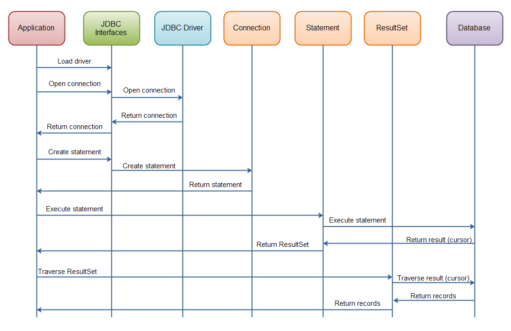

# Introduction to JDBC



These topics are the foundation of professional Java backend development. Once you master them, you'll understand how frameworks like Spring Boot communicate with databases under the hood.

---

## What is JDBC?

**JDBC (Java Database Connectivity)** is Java's standard API for communicating with relational databases.

It allows Java applications to:

- Connect to a database
- Execute SQL statements
- Retrieve data
- Insert, update, and delete records
- Manage transactions

Think of JDBC as a translator between Java and a database.

```
Java Application
       │
       ▼
     JDBC API
       │
       ▼
JDBC Driver (PostgreSQL/MySQL)
       │
       ▼
 Database Server
```

---

## JDBC Architecture

```
Java Program
      │
      ▼
DriverManager
      │
      ▼
 JDBC Driver
      │
      ▼
 Database
```

The JDBC driver is supplied by the database vendor.

Examples:

- PostgreSQL → postgresql.jar
- MySQL → mysql-connector-j
- SQL Server → mssql-jdbc

---

# 1. DriverManager & Connection

## DriverManager

Responsible for creating database connections.

```java
Connection con =
DriverManager.getConnection(url, user, password);
```

DriverManager

- Finds the appropriate JDBC driver
- Opens the connection
- Returns a Connection object

---

## JDBC URL

Example PostgreSQL

```text
jdbc:postgresql://localhost:5432/shop
```

Structure

```
jdbc:<database>://host:port/database
```

Example

```
jdbc:mysql://localhost:3306/company

jdbc:postgresql://localhost:5432/shop

jdbc:sqlserver://localhost:1433;databaseName=Store
```

---

## Connection

Represents an active connection to the database.

```java
Connection con =
DriverManager.getConnection(url,user,password);
```

Responsibilities

- execute SQL
- create statements
- begin transactions
- commit changes
- rollback changes
- close connection

---

## Opening a Connection

```java
String url = "jdbc:postgresql://localhost:5432/shop";

String username = "postgres";

String password = "secret";

Connection con =
DriverManager.getConnection(url, username, password);
```

---

## Closing Connections

Always close.

```
Connection
Statement
ResultSet
```

in reverse order

```
ResultSet
↓

Statement
↓

Connection
```

Never leave connections open.

Database connections are limited resources.

---

## Auto Commit

By default

```java
con.getAutoCommit();
```

returns

```
true
```

Meaning every SQL statement is immediately committed.

---

# 2. Statement

A Statement executes SQL.

```java
Statement st = con.createStatement();
```

Example

```java
Statement st = con.createStatement();

ResultSet rs =
st.executeQuery("SELECT * FROM product");
```

---

## Methods

### executeQuery()

Used for SELECT.

```java
ResultSet rs =
st.executeQuery(sql);
```

Returns

```
ResultSet
```

---

### executeUpdate()

For

- INSERT
- UPDATE
- DELETE

Returns

```
int
```

(number of affected rows)

```java
int rows =
st.executeUpdate(sql);
```

---

### execute()

General-purpose method.

Returns

```
boolean
```

Useful when you don't know whether SQL returns data.

---

# Why Statement is Dangerous

Imagine

```java
String username =
scanner.nextLine();

String sql =
"SELECT * FROM users WHERE username='"
+ username + "'";
```

Suppose the user enters

```sql
' OR 1=1 --
```

The SQL becomes

```sql
SELECT *
FROM users
WHERE username=''
OR 1=1 --
```

Now every user is returned.

This is called

# SQL Injection

One of the oldest and most dangerous web vulnerabilities.

Never concatenate user input into SQL.

---

# 3. PreparedStatement

PreparedStatement solves SQL Injection.

Instead of concatenating values

```
SQL
↓

Placeholders

↓

Bind Values
```

Example

```java
String sql =
"SELECT * FROM users WHERE username=?";

PreparedStatement ps =
con.prepareStatement(sql);

ps.setString(1, username);

ResultSet rs =
ps.executeQuery();
```

---

## Placeholder

```
?
```

represents a parameter.

---

## Setting Parameters

```java
ps.setString(1,"Laptop");

ps.setInt(2,5);

ps.setDouble(3,19.99);

ps.setBoolean(4,true);

ps.setDate(5,date);
```

Index starts at

```
1
```

NOT zero.

---

## Why PreparedStatement is Better

### Prevents SQL Injection

Input

```
' OR 1=1 --
```

is treated as text

NOT SQL.

---

### Faster

Database compiles SQL once.

Only parameter values change.

Repeated execution becomes much faster.

---

### Cleaner

Instead of

```java
"... WHERE id="+id
```

You write

```java
"... WHERE id=?"
```

---

## Insert Example

```java
String sql =
"INSERT INTO product(productName,type)
VALUES (?,?)";

PreparedStatement ps =
con.prepareStatement(sql);

ps.setString(1,"Phone");

ps.setString(2,"Electronics");

ps.executeUpdate();
```

---

# 4. ResultSet

ResultSet stores rows returned by SELECT.

```
SELECT
↓

ResultSet
↓

Rows
```

---

## Cursor

Initially

```
Before First Row
```

Calling

```java
rs.next();
```

moves to first row.

```
Before First

↓

Row1

↓

Row2

↓

Row3

↓

End
```

---

## Reading Columns

By index

```java
rs.getInt(1);

rs.getString(2);
```

By column name

```java
rs.getInt("productId");

rs.getString("productName");
```

Column names improve readability.

---

## Common Getters

```
getInt()

getString()

getDouble()

getBoolean()

getDate()

getTimestamp()
```

---

## Iterating

```java
while(rs.next()){

    int id =
    rs.getInt("productId");

    String name =
    rs.getString("productName");

    System.out.println(id+" "+name);

}
```

---

# Mapping Rows to Objects

Instead of printing

Create objects.

Example

```java
public class Product{

    private int id;

    private String name;

}
```

Mapping

```java
Product p =
new Product();

p.setId(rs.getInt("productId"));

p.setName(
rs.getString("productName"));
```

Now Java works with objects instead of SQL rows.

This becomes essential for ORMs like JPA/Hibernate.

---

# 5. Transactions

Imagine transferring money.

```
Withdraw

↓

Deposit
```

If the app crashes after withdrawing...

Money disappears.

Transactions prevent this.

---

## ACID

### Atomicity

Everything succeeds

OR

Nothing happens.

---

### Consistency

Database stays valid.

---

### Isolation

Concurrent transactions don't interfere.

---

### Durability

Committed changes survive crashes.

---

## Auto Commit Off

```java
con.setAutoCommit(false);
```

Now nothing is saved until

```java
con.commit();
```

---

## Commit

```java
con.commit();
```

Makes all changes permanent.

---

## Rollback

```java
con.rollback();
```

Undoes every change since the transaction began.

---

## Example

```java
try{

    con.setAutoCommit(false);

    withdraw();

    deposit();

    con.commit();

}catch(Exception e){

    con.rollback();

}
```

If deposit fails

withdraw is undone.

---

# Savepoints

Partial rollback.

```java
Savepoint sp =
con.setSavepoint();

...

con.rollback(sp);
```

Useful in long transactions.

---

# 6. Batch Processing

Instead of

```
INSERT

INSERT

INSERT

INSERT
```

sending 10,000 SQL commands,

JDBC groups them together.

---

## Why Use Batch?

- Much faster
- Fewer network trips
- Lower overhead

---

## Example

```java
PreparedStatement ps =
con.prepareStatement(
"INSERT INTO product(name) VALUES(?)");

for(Product p : products){

    ps.setString(1,p.getName());

    ps.addBatch();

}

ps.executeBatch();
```

---

## executeBatch()

Returns

```
int[]
```

Each value indicates affected rows.

---

# Week 5 — Connection Pooling & Advanced JDBC

# Why Connection Pooling?

Creating a connection is expensive.

Typical cost

```
50ms

100ms

200ms
```

Imagine

100 users.

Without pooling

```
Open Connection

↓

Authenticate

↓

Allocate Resources

↓

Execute Query

↓

Close
```

Repeated every request.

Very slow.

---

# Connection Pool

Instead

```
Application

↓

Connection Pool

↓

Database
```

Connections stay open.

Application borrows one.

Returns it when finished.

No expensive reconnection.

---

## Benefits

- Faster
- Lower CPU usage
- Better scalability
- Handles concurrency

---

# HikariCP

The fastest JDBC connection pool.

Used by default in Spring Boot.

Features

- Extremely fast
- Lightweight
- Reliable
- Production-ready

---

## Basic Configuration

```java
HikariConfig config = new HikariConfig();

config.setJdbcUrl(url);

config.setUsername(user);

config.setPassword(password);

HikariDataSource ds =
new HikariDataSource(config);
```

Getting a connection

```java
Connection con =
ds.getConnection();
```

Looks the same as DriverManager,

but now it's pooled.

---

# Pool Sizing

Too few connections

```
Requests wait.

↓

High latency.
```

Too many

```
Database overloaded.

↓

Memory wasted.
```

Starting formula

```
connections =
(core_count × 2)
+
effective_spindle_count
```

Example

```
8 cores

SSD

connections

≈16
```

This is a starting point. The optimal size depends on your workload, database, and hardware, so monitor and adjust based on real-world performance.

---

# Connection Lifecycle

```
Pool Starts

↓

Creates Connections

↓

Application Borrows

↓

Executes SQL

↓

Returns Connection

↓

Pool Reuses Connection
```

Notice

Connection is NOT destroyed.

It returns to the pool.

---

# Schema Migrations

Never manually modify production databases.

Instead

Version every change.

Example

```
V1__create_product.sql

V2__add_price.sql

V3__create_orders.sql
```

---

# Flyway

Simple migration tool.

On startup

```
Checks database

↓

Looks for new migrations

↓

Runs missing ones

↓

Updates version history
```

Every environment stays synchronized.

---

# Liquibase

Another migration framework.

Supports

- SQL migrations
- XML
- YAML
- JSON

More powerful for complex enterprise projects.

---

# Why Migrations Matter

Without migrations

```
Developer A changes DB

↓

Developer B forgets

↓

Production differs

↓

Application breaks
```

With migrations

```
Every schema change

↓

Version controlled

↓

Repeatable

↓

Automatic

↓

Safe deployment
```

---

# JDBC Best Practices

- Use **`PreparedStatement`** for any SQL with parameters.
- Close resources in reverse order: **`ResultSet → Statement → Connection`**, or use **try-with-resources**.
- Keep transactions as short as possible.
- Use batch processing for large inserts or updates.
- Never hardcode credentials in source code; use configuration files or environment variables.
- Use a connection pool (such as **HikariCP**) in production instead of creating connections with `DriverManager` for every request.
- Version your database schema with migration tools like **Flyway** or **Liquibase**.

---

# Learning Roadmap

1. Build a simple CRUD application using `DriverManager`.
2. Replace all `Statement` usage with `PreparedStatement`.
3. Practice mapping `ResultSet` rows into Java objects (DTOs or entities).
4. Implement transactions with `commit()` and `rollback()`.
5. Insert thousands of records using batch processing and compare the execution time.
6. Replace `DriverManager` with **HikariCP** and observe the performance improvement.
7. Add **Flyway** or **Liquibase** so your database schema is created and updated automatically.
