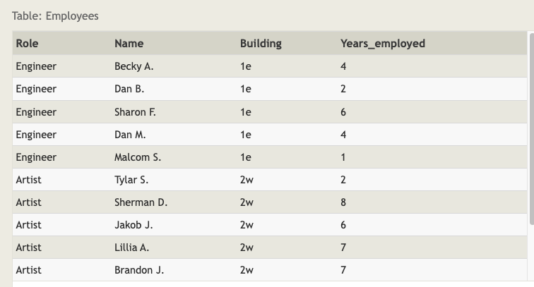

# SQL Lesson 10: Queries with aggregates (Pt. 1)



## Exercise 10 — Tasks

1 - Find the longest time that an employee has been at the studio

```sql
SELECT MAX(years_employed) as Max_years_employed
FROM employees;
```

2 - For each role, find the average number of years employed by employees in that role

```sql
SELECT role, AVG(years_employed) as Average_years_employed
FROM employees
GROUP BY role;
```

3 - Find the total number of employee years worked in each building

```sql
SELECT building, SUM(years_employed) as Total_years_employed
FROM employees
GROUP BY building;
```
