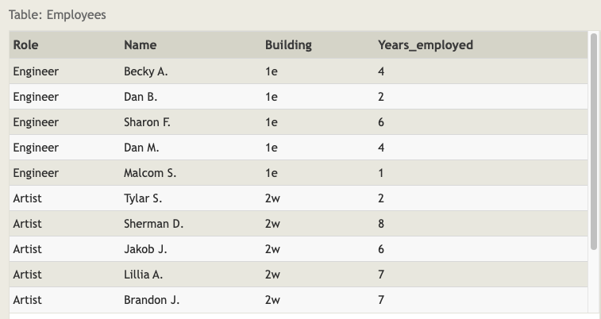

# SQL Lesson 11: Queries with aggregates (Pt. 2)



## Exercise 11 — Tasks

1 - Find the number of Artists in the studio (without a HAVING clause)

```sql
SELECT role, COUNT(*) as Number_of_artists
FROM employees
WHERE role = "Artist";
```

2 - Find the number of Employees of each role in the studio

```sql
SELECT role, COUNT(*)
FROM employees
GROUP BY role;
```

3 - Find the total number of years employed by all Engineers

```sql
SELECT role, SUM(years_employed)
FROM employees
GROUP BY role
HAVING role = "Engineer";
```
