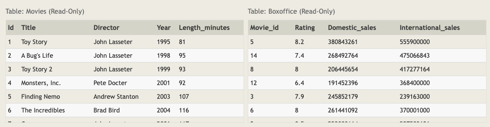

# SQL Lesson 12: Order of execution of a Query



## Exercise 12 — Tasks

1 - Find the number of movies each director has directed

```sql
SELECT director, COUNT(id) as Num_movies_directed
FROM movies
GROUP BY director;
```

2 - Find the total domestic and international sales that can be attributed to each director

```sql
SELECT director, SUM(domestic_sales + international_sales) as Cumulative_sales_from_all_movies
FROM movies
    INNER JOIN boxoffice
        ON movies.id = boxoffice.movie_id
GROUP BY director;
```
