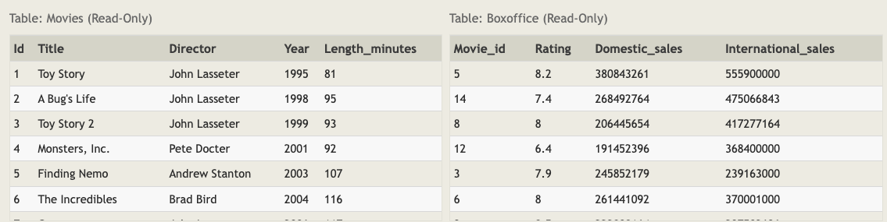

# SQL Lesson 6: Multi-table queries with JOINs



## Exercise 6 — Tasks

1 - Find the domestic and international sales for each movie

```sql
SELECT title, domestic_sales, international_sales
FROM movies
  JOIN boxoffice
    ON movies.id = boxoffice.movie_id;
```

2 - Show the sales numbers for each movie that did better internationally rather than domestically

```sql
SELECT title, domestic_sales, international_sales
FROM movies
  JOIN boxoffice
    ON movies.id = boxoffice.movie_id
WHERE international_sales > domestic_sales;
```

3 - List all the movies by their ratings in descending order

```sql
SELECT title, rating
FROM movies
  JOIN boxoffice
    ON movies.id = boxoffice.movie_id
ORDER BY rating DESC;
```
